# Finnep Event App Backend - Architecture Documentation

## Table of Contents

1. [System Overview](#system-overview)
2. [Architecture Diagrams](#architecture-diagrams)
3. [Data Flow](#data-flow)
4. [Security Architecture](#security-architecture)
5. [Database Architecture](#database-architecture)
6. [Message Queue Architecture](#message-queue-architecture)
7. [Component Details](#component-details)

---

## System Overview

The Finnep Event App Backend is a RESTful API server built with Node.js and Express.js. It serves as the core backend infrastructure for event management, ticket sales, payment processing, and administrative operations.

### Key Technologies

- **Runtime:** Node.js (ES6 modules)
- **Framework:** Express.js
- **Database:** MongoDB with Mongoose ODM
- **Cache:** Redis
- **Message Queue:** RabbitMQ (AMQP)
- **Payment Gateway:** Stripe
- **File Storage:** AWS S3 with CloudFront CDN
- **Email Service:** Nodemailer
- **Job Scheduler:** Agenda.js
- **Logging:** Winston

---

## Architecture Diagrams

### 1. System Overview

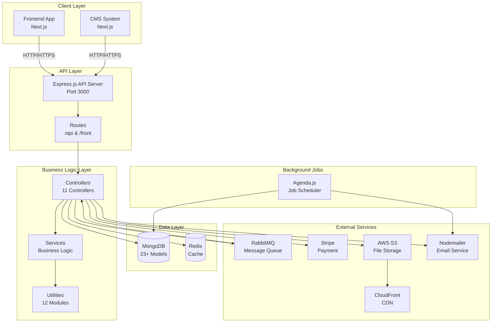

### 2. Request Flow Architecture

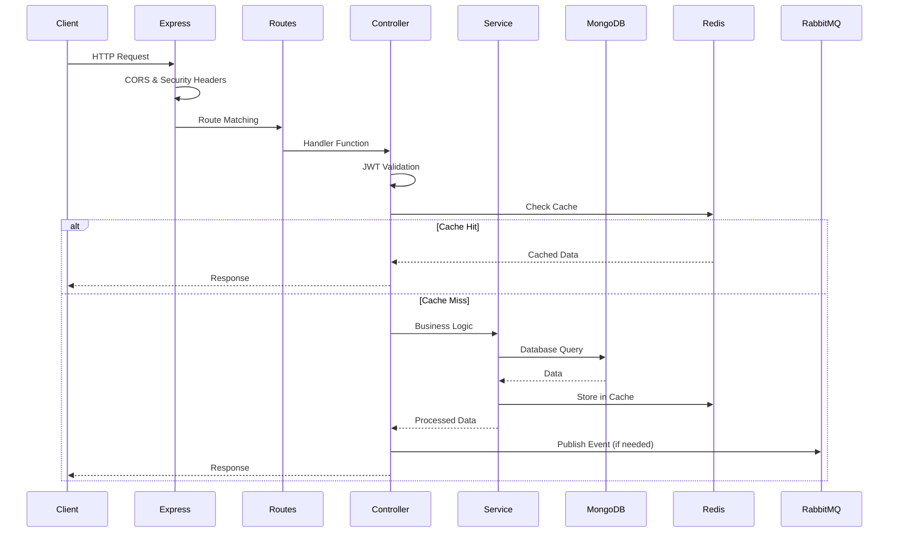

### 3. Authentication & Authorization Flow

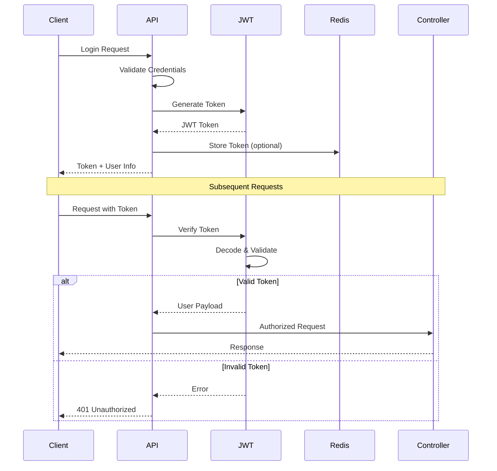

### 4. Payment Processing Flow

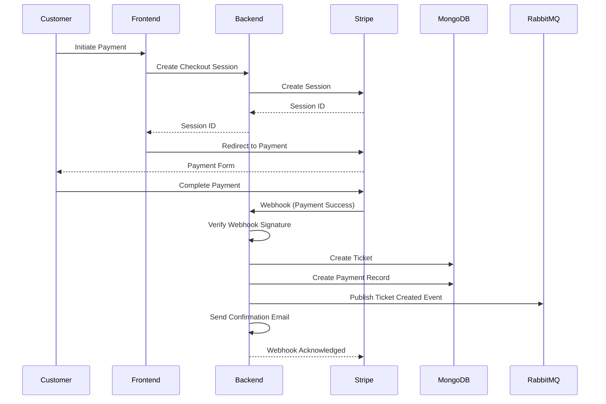

### 5. Message Queue Architecture

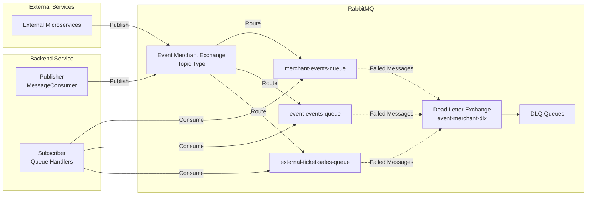

### 6. Database Schema Relationships

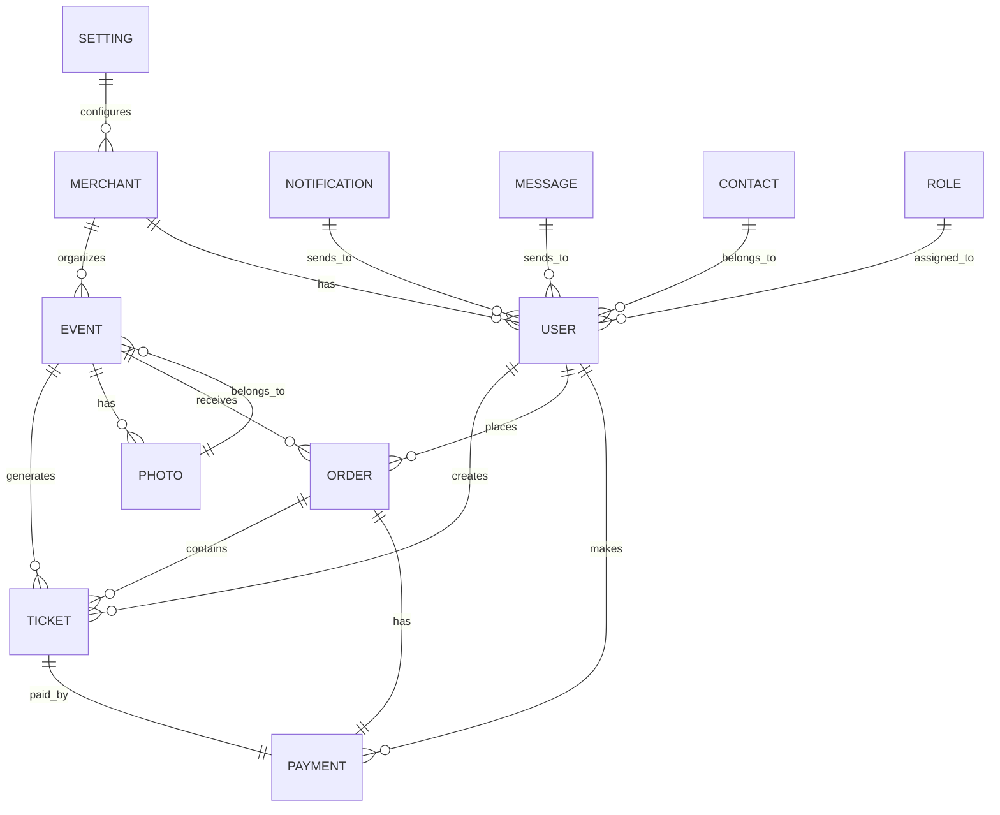

---

## Data Flow

### 1. Event Creation Flow

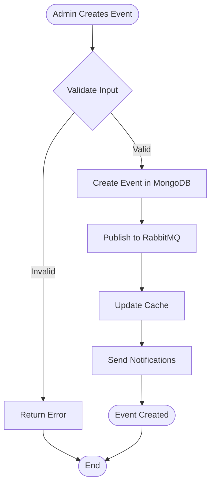

### 2. Ticket Purchase Flow

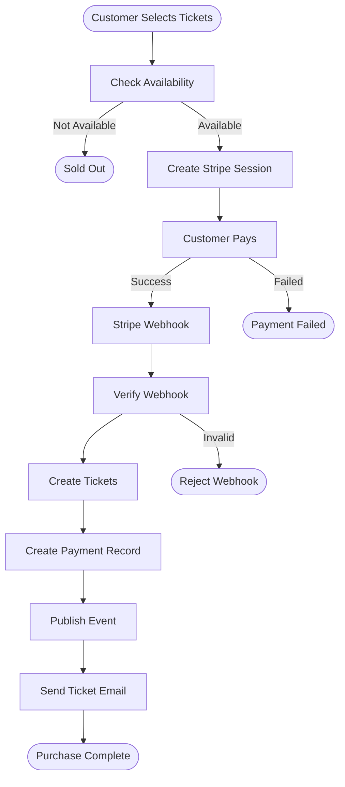

### 3. Guest Ticket Access Flow

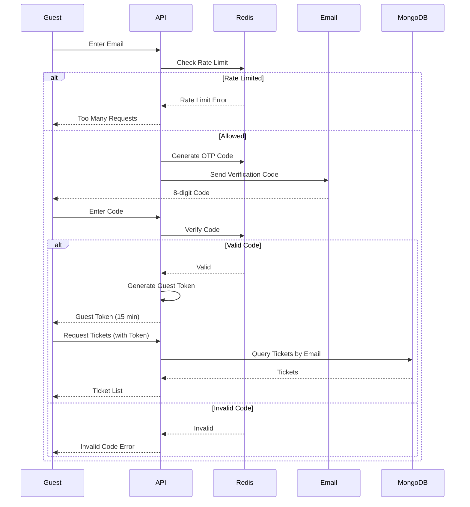

---

## Security Architecture

### 1. Security Layers

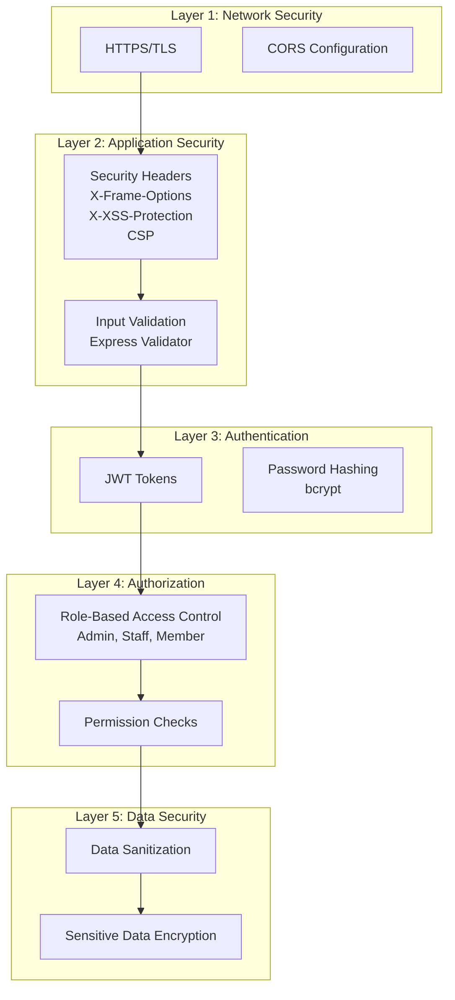

### 2. JWT Token Structure

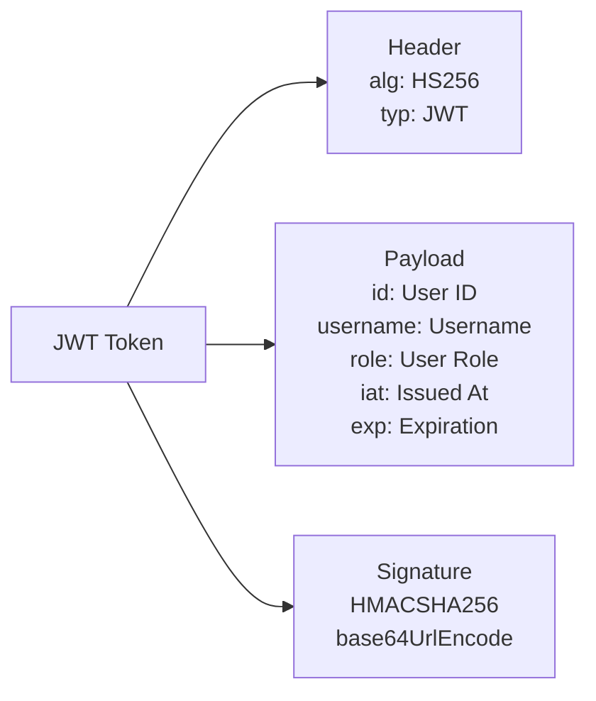

### 3. Role-Based Access Control

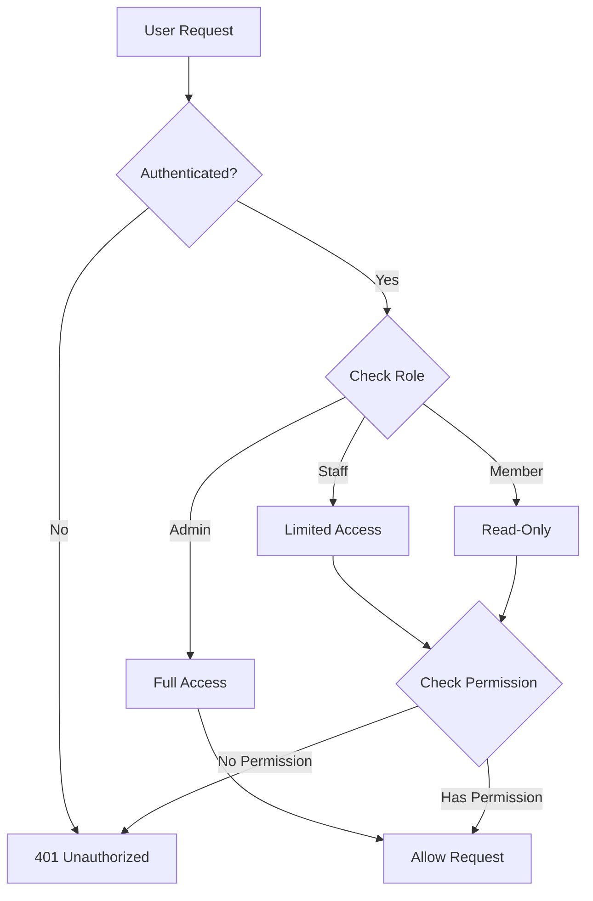

---

## Database Architecture

### 1. MongoDB Connection Strategy

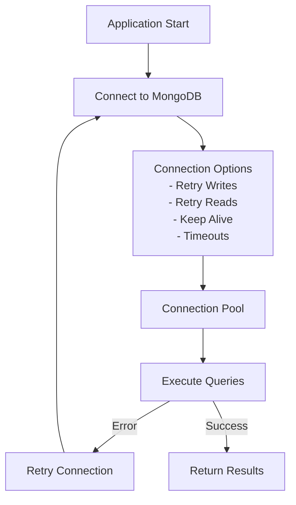

### 2. Data Models Overview

The backend uses **23+ Mongoose models**:

- **Core Models:** User, Role, Merchant, Event, Ticket, Order, Payment
- **Content Models:** Photo, PhotoType, Notification, Message, Contact
- **System Models:** Setting, Token, Venue, SocialMedia
- **Audit Models:** AuditTrail (via plugin)
- **Integration Models:** InboxMessage, OutboxMessage, ExternalTicketSales

### 3. Indexing Strategy

- **Primary Keys:** All models have `_id` indexed
- **Foreign Keys:** References to other models are indexed
- **Query Fields:** Frequently queried fields are indexed
- **Compound Indexes:** Multi-field queries use compound indexes

---

## Message Queue Architecture

### 1. Queue Setup

The backend consumes messages from three queues:

1. **merchant-events-queue** - Merchant lifecycle events
2. **event-events-queue** - Event lifecycle events
3. **external-ticket-sales-queue** - External ticket sales data

### 2. Message Handlers

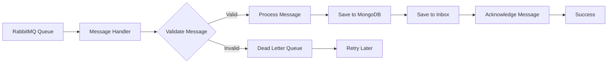

### 3. Dead Letter Queue (DLQ)

- **Exchange:** `event-merchant-dlx` (topic type)
- **Queue:** `dlq.external-ticket-sales-queue.retry-1`
- **Purpose:** Handle failed messages for retry
- **Retry Strategy:** Exponential backoff

---

## Component Details

### 1. Controllers (11 Controllers)

- **api.controller.js** - Admin API endpoints
- **front.controller.js** - Public-facing endpoints
- **event.controller.js** - Event management
- **ticket.controller.js** - Ticket management
- **user.controller.js** - User management
- **merchant.controller.js** - Merchant management
- **photo.controller.js** - Photo management
- **notification.controller.js** - Notification management
- **setting.controller.js** - Settings management
- **message.controller.js** - Message management
- **contact.controller.js** - Contact management
- **guest.controller.js** - Guest ticket access
- **report.controller.js** - Financial reports

### 2. Services

- **externalTicketSalesRequest.js** - Request external ticket sales data

### 3. Utilities (12 Modules)

- **common.js** - Common utility functions
- **aws.js** - AWS S3 and CloudFront utilities
- **jwtToken.js** - JWT token generation and validation
- **paymentActions.js** - Stripe payment processing
- **sendMail.js** - Email sending utilities
- **rabbitmq.js** - RabbitMQ connection management
- **busboyFileUpload.js** - File upload processing
- **createHash.js** - Password hashing utilities
- **ticketMaster.js** - Ticket generation and management
- **schedular.js** - Job scheduling utilities
- **adminUser.js** - Admin user management
- **uploadQueueProcess.js** - Background upload processing

### 4. Background Jobs (Agenda.js)

- **Email Retry Jobs** - Retry failed email sends
- **Event Status Updates** - Update event statuses
- **Cleanup Jobs** - Periodic cleanup tasks

---

## Deployment Architecture

### 1. Production Deployment

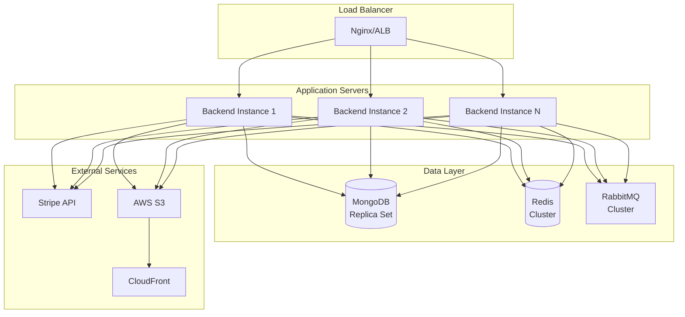

### 2. Scaling Strategy

- **Horizontal Scaling:** Stateless API servers can be scaled horizontally
- **Database Scaling:** MongoDB replica sets for read scaling
- **Cache Scaling:** Redis cluster for distributed caching
- **Queue Scaling:** RabbitMQ cluster for high availability

---

## Performance Optimizations

1. **Redis Caching:** Frequently accessed data cached in Redis
2. **Database Indexing:** Optimized queries with proper indexes
3. **Connection Pooling:** MongoDB and Redis connection pooling
4. **CDN Integration:** Static assets served via CloudFront
5. **Async Processing:** Background jobs for heavy operations
6. **Message Queues:** Asynchronous event processing

---

## Monitoring & Logging

- **Winston Logger:** Structured logging with daily rotation
- **Error Logging:** Detailed error logs with stack traces
- **Request Logging:** All API requests logged
- **Health Checks:** Endpoint health monitoring
- **Log Files:** Daily rotated log files in `logs/` directory

---

**Last Updated:** 2025-01-15
**Version:** 1.0

